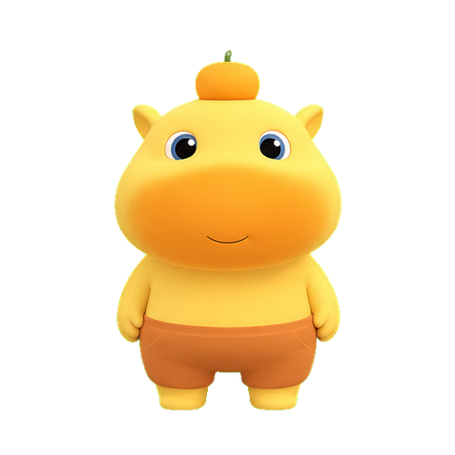
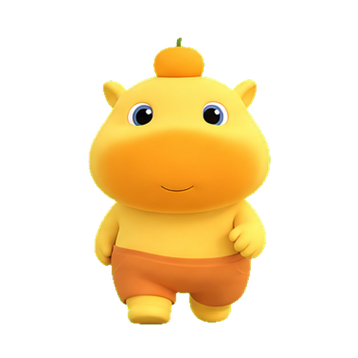
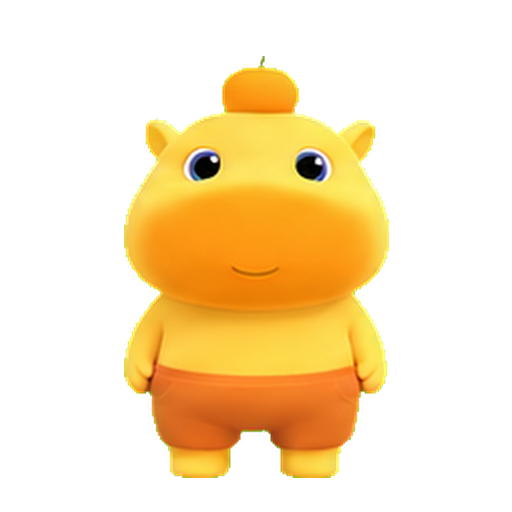
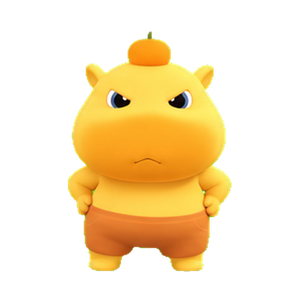
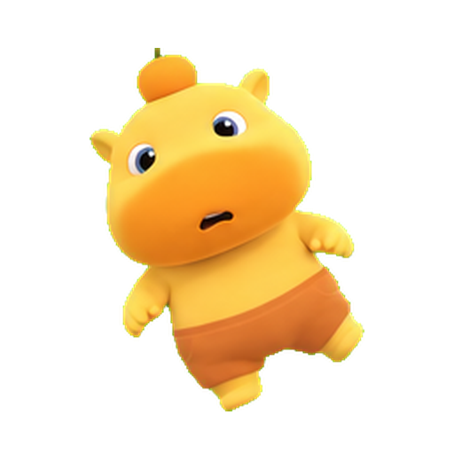

# LuluPet 桌面宠物

LuluPet 是一个 Windows 桌面宠物应用。它使用 WPF 做透明置顶窗口，通过 PNG 序列帧播放宠物动作，并用托盘菜单管理显示、隐藏、设置、点击穿透和开机启动。

## 资源预览

| Idle | Walk | Happy | Eat |
|---|---|---|---|
|  |  |  |  |

| Angry | Drag | Sleep | 气泡 |
|---|---|---|---|
|  |  |  |  |

| App Icon | Feed Button | Hug Button |
|---|---|---|
|  |  |  |

## 宠物操作逻辑

- 左键单击宠物：播放 `Happy` 动作，并显示随机气泡文本。
- 左键双击宠物：播放 `Angry` 动作，并显示 `人，再敲打你哦！`。
- 右键单击宠物：播放 `Eat` 动作，并显示 `开饭啦！`。
- 左键拖拽宠物：窗口跟随鼠标移动，并播放 `Drag` 动作；向左拖动时宠物会镜像。
- 自动状态：宠物会在 `Idle`、`Walk`、`Sleep` 之间切换。
- Walk 状态：进入 Walk 时随机一次行走方向，单次 Walk 不会中途拐弯；到达屏幕边界后回到 Idle，并显示 `（桌面巡逻中）`。
- 快捷键验收：`I` 强制 Idle，`W` 强制 Walk，`S` 强制 Sleep。

气泡文本中，`人，再敲打你哦！`、`开饭啦！`、`（桌面巡逻中）` 是行为专属文案，不会作为普通随机对白出现。

## 托盘和设置

托盘菜单提供：

- `显示` / `隐藏`
- `设置`
- `点击穿透`
- `开机启动`
- `退出`

设置项会立即生效并持久化到 `settings.json`：

- `appearance.scale`：宠物缩放，范围 `0.3` 到 `1.5`
- `appearance.opacity`：透明度，范围 `0.35` 到 `1.0`
- `audio.volume`：预留音量设置，当前没有音频播放逻辑
- `interaction.clickThrough`：点击穿透开关
- `startup.autoStart`：当前用户 Windows `Run` 注册表开机启动

运行时数据位置：

```text
%LOCALAPPDATA%\LuluPet\data\lulupet.db
```

异常日志位置：

```text
%LOCALAPPDATA%\LuluPet\crash.log
```

## 项目架构

```text
src/
  LuluPet.App/      WPF 桌面应用、主窗口、设置窗口、托盘、交互逻辑
  LuluPet.Core/     动画播放器、状态机、配置、对白、SQLite 持久化
  LuluPet.Win32/    Windows API 封装：窗口样式、点击穿透、开机启动
assets/
  pet/              宠物 PNG 序列帧
  ui/               气泡和按钮图片
  icons/            exe 和托盘图标
tests/
  LuluPet.Core.Tests/
docs/
  PLAN.md
  acceptance/       各阶段静态验收和发布检查记录
```

核心数据流：

```text
PetStateMachine
  -> MainWindow.OnPetStateChanged
  -> FrameAnimationPlayer.Play(action)
  -> FrameAnimationPlayer.FrameChanged
  -> MainWindow.SetPetFrame
  -> PetImage.Source
```

交互动作不会进入核心状态机枚举，而是由 `MainWindow` 作为临时动作播放：

- click -> `Happy`
- double click -> `Angry`
- right click -> `Eat`
- drag -> `Drag`

状态机负责长期状态：

- `Idle`
- `Walk`
- `Sleep`

## 下载和运行

推荐从 GitHub Actions 或 Release 下载 Windows x64 构建：

- Actions artifact：`LuluPet-win-x64-ci-<run-number>`
- Release asset：`LuluPet-win-x64-v版本号.zip`，例如 `LuluPet-win-x64-v1.0.1.zip`

下载 zip 后先解压，再双击解压目录里的 `LuluPet.exe` 运行。不要只单独复制 exe；运行目录需要同时保留 `Assets/`、`settings.json` 等资源文件。首次启动后会显示透明桌面宠物，同时右下角托盘区域会出现 LuluPet 图标。

## 开发和构建

WPF 应用目标框架是 `net8.0-windows`。Windows 发布构建由 GitHub Actions 的 Windows runner 完成；Ubuntu 环境主要用于静态检查和 Core 层测试。

Windows 本机可使用：

```powershell
dotnet restore
dotnet test --configuration Release --no-restore
dotnet publish src/LuluPet.App/LuluPet.App.csproj -c Release -r win-x64 --self-contained true /p:PublishSingleFile=true /p:IncludeNativeLibrariesForSelfExtract=true /p:EnableWindowsTargeting=true -o publish/win-x64
```

Ubuntu 本机如果缺少 `Microsoft.NET.Sdk.WindowsDesktop`，完整 WPF 构建会失败，这是预期限制。最终发布以 GitHub Actions Windows 构建为准。

## 发布和回滚

`main` push、PR、手动触发都会运行 Windows build workflow。推送 `v*` 标签会创建或更新 GitHub Release，并上传：

- `LuluPet-win-x64-v版本号.zip`
- `LuluPet-win-x64-v版本号.zip.sha256.txt`

GitHub Release 页面还会自动提供该 tag 对应的 Source code zip/tar.gz。

发布 `v1.0.1`：

```bash
git tag v1.0.1
git push origin v1.0.1
```

回滚策略：

- 代码回滚：`git revert <bad-commit>`，重新等待 CI 通过。
- Release 回滚：标注或移除异常 Release，并把上一个稳定版本作为推荐下载。
- 数据回滚：关闭 LuluPet，备份或恢复 `%LOCALAPPDATA%\LuluPet\data\lulupet.db`，再运行上一个稳定 exe。
