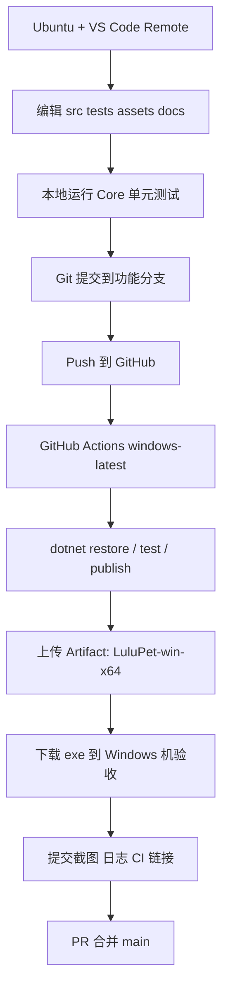
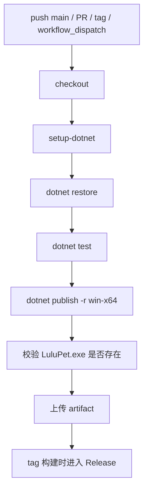

# LuluPet Windows 桌面宠物开发计划

> 建议直接保存为 `docs/PLAN.md`。本文以**第一人称**编写，默认项目名为 **LuluPet**，目标产品为 **Windows 桌面宠物：水豚噜噜**。

## Executive Summary

我要开发的是一款 **Windows-only** 的桌面宠物软件，核心形象是“水豚噜噜”。我已经确定技术路线为 **C# + .NET 8 + WPF + Win32 API**，开发环境采用 **Ubuntu + VS Code Remote**，代码托管在 GitHub，持续集成使用 **GitHub Actions 的 `windows-latest` runner** 编译和发布 Windows `exe`。这一组合的关键原因是：WPF 本身就是 Windows-only UI 框架，适合做桌面窗口；WPF `Window` 支持 `Topmost`、`ShowInTaskbar` 等窗口行为配置；透明异形窗口需要 `AllowsTransparency=true` 且 `WindowStyle=None`；而需要进一步处理置顶、点击穿透、工具窗口样式时，可以通过 WPF/Win32 互操作拿到 `HWND`，再调用 Win32 API 和扩展窗口样式完成。citeturn5search4turn7search0turn18search0turn18search1turn6search14turn6search15turn6search12turn0search2

因为我的日常开发环境不是 Windows，所以我不会强求在 Ubuntu 本地完整运行 WPF UI；我会把 **状态机、配置、动画调度、数据库访问** 等逻辑尽量放在跨平台可测的 `Core` 层，在 Ubuntu 上完成编写和单元测试；真正依赖 Windows 桌面行为的部分放在 `App` 和 `Win32` 层，并通过 GitHub Actions 的 Windows runner 负责编译和产出 `exe`。对于在 Linux/macOS 上构建 Windows 目标，.NET 官方明确要求设置 `EnableWindowsTargeting=true`。GitHub 官方则推荐在 Actions 中使用 `actions/setup-dotnet` 来保证 .NET 环境的一致性。citeturn1search0turn1search4turn0search3turn0search7

我会把项目拆成若干可回滚、可验收、可独立合并的 Phase，每个 Phase 都包含：任务清单、在 VS Code 中调用 Codex 的具体命令、最小可验证输出、CI 验收项、提交和 PR 规范、证据要求。发布上我会采用 **SemVer**，通过 Git tag 触发 Release 构建，使用 `dotnet publish -r win-x64` 发布 **single-file** 自包含 Windows 可执行文件。需要注意的是，GitHub 的 `-latest` runner 标签存在渐进迁移机制，因此我会保留“必要时临时 pin 到具体 Windows 版本标签”的回退方案，但当前主线仍使用 `windows-latest`，符合既定路线。citeturn1search1turn1search5turn1search9turn1search13turn1search15turn8search2turn8search3turn3search15turn4search19

## 基线架构与仓库布局

我会坚持“**核心逻辑跨平台，桌面表现 Windows-only**”的架构原则。WPF 项目使用 `net8.0-windows` 目标框架并设置 `UseWPF=true`；WPF/Win32 互操作通过 `WindowInteropHelper.Handle` 或 `HwndSource` 获得宿主窗口句柄；透明窗口与扩展样式由 Win32 扩展样式和 `SetWindowPos` 控制。WPF 这类桌面项目在 SDK 风格项目中应使用 Windows 特定 TFM，例如 `net8.0-windows`，并启用 `UseWPF`。citeturn5search0turn5search3turn5search5turn6search2turn6search3turn6search14



上面的工作流之所以成立，是因为 GitHub-hosted runner 会在 Azure 虚拟机上启动全新环境执行作业，`.github/workflows` 是官方规定的工作流位置，而 `workflow_dispatch`、`push.tags` 等事件可以用于手动和标签触发构建。citeturn8search0turn8search12turn3search3turn3search5turn3search15turn4search11turn4search19

### 推荐目录结构

| 路径 | 作用 | 我为什么这样拆 |
|---|---|---|
| `src/LuluPet.App` | WPF 主程序、窗口、托盘、交互入口 | 只放 Windows UI 相关代码，避免污染核心逻辑 |
| `src/LuluPet.Core` | 状态机、配置、动画调度、对话逻辑、领域模型 | 便于在 Ubuntu 上运行单元测试 |
| `src/LuluPet.Win32` | Win32 P/Invoke、窗口样式、置顶/穿透/句柄操作 | 将平台细节单独隔离 |
| `tests/LuluPet.Core.Tests` | 逻辑层单元测试 | `dotnet test` 能稳定在 CI 中跑通。citeturn1search2turn1search14 |
| `assets/pet` | PNG 序列帧资源 | WPF 内置支持 PNG 解码，适合 MVP 序列帧动画。citeturn2search3turn2search7 |
| `assets/icons` | 托盘图标、应用图标 | 托盘依赖 `NotifyIcon`。citeturn19search0turn19search1 |
| `docs` | 计划、截图、验收记录、运行日志 | 把证据和决策固定在仓库里 |
| `.github/workflows` | CI 与发布工作流 | GitHub Actions 官方规定目录。citeturn3search3turn3search19 |
| `scripts/codex` | 复用 Codex 执行脚本 | 让每个 Phase 的自动化调用保持一致 |
| `prompts` | 每个 Phase 的 Codex 提示词文件 | 便于复盘、复用和审计 |

### 我会使用的最小工程骨架

```text
LuluPet/
├─ src/
│  ├─ LuluPet.App/
│  │  ├─ App.xaml
│  │  ├─ App.xaml.cs
│  │  ├─ MainWindow.xaml
│  │  ├─ MainWindow.xaml.cs
│  │  ├─ Services/
│  │  └─ Assets/
│  ├─ LuluPet.Core/
│  │  ├─ Animation/
│  │  ├─ Behavior/
│  │  ├─ Config/
│  │  ├─ Domain/
│  │  └─ Persistence/
│  └─ LuluPet.Win32/
│     ├─ NativeMethods.cs
│     ├─ WindowStyles.cs
│     └─ WindowExtensions.cs
├─ tests/
│  └─ LuluPet.Core.Tests/
├─ assets/
│  ├─ pet/
│  ├─ icons/
│  └─ ui/
├─ docs/
│  ├─ PLAN.md
│  ├─ screenshots/
│  ├─ logs/
│  └─ acceptance/
├─ prompts/
├─ scripts/
│  └─ codex/
└─ .github/
   └─ workflows/
```

## 静态资源准备清单

WPF 的成像管线原生支持 BMP、JPEG、PNG、TIFF、GIF、ICON 等格式；同时，WPF 透明/异形窗口的实现依赖窗口透明能力，因此我在 MVP 阶段优先使用 **PNG 序列帧**，要求带 **完整 Alpha 通道**，避免一开始就把动画制作复杂度推到 Spine/Live2D。`Image` 常见加载方式可直接使用 `BitmapImage`。citeturn2search3turn2search7turn2search15turn7search0turn7search4

### 资源总表

| 分类 | 动作/用途 | 建议帧数 | 建议单帧分辨率 | 透明通道 | 命名规范 | 示例文件名 | 是否首版必需 |
|---|---|---:|---:|---|---|---|---|
| 角色动画 | `idle` 待机 | 8 | 512×512 | 必须 RGBA | `lulu_idle_0001.png` | `lulu_idle_0001.png` | 是 |
| 角色动画 | `walk` 行走 | 12 | 512×512 | 必须 RGBA | `lulu_walk_0001.png` | `lulu_walk_0007.png` | 是 |
| 角色动画 | `sleep` 睡觉 | 8 | 512×512 | 必须 RGBA | `lulu_sleep_0001.png` | `lulu_sleep_0004.png` | 是 |
| 角色动画 | `happy` 开心/被摸头 | 8 | 512×512 | 必须 RGBA | `lulu_happy_0001.png` | `lulu_happy_0008.png` | 是 |
| 角色动画 | `eat` 吃草 | 10 | 512×512 | 必须 RGBA | `lulu_eat_0001.png` | `lulu_eat_0010.png` | 否 |
| 角色动画 | `drag` 被拖拽 | 4 | 512×512 | 必须 RGBA | `lulu_drag_0001.png` | `lulu_drag_0002.png` | 否 |
| 角色动画 | `surprised` 惊讶 | 4 | 512×512 | 必须 RGBA | `lulu_surprised_0001.png` | `lulu_surprised_0004.png` | 否 |
| 表情 UI | 气泡底图 | 1~2 | 384×160 | 必须 RGBA | `bubble_default.png` | `bubble_default.png` | 是 |
| 表情 UI | 心情图标 | 3 | 64×64 | 建议 RGBA | `mood_happy.png` | `mood_hungry.png` | 否 |
| 托盘/应用 | 应用图标 `.ico` | 1 | 多尺寸打包 | 不适用 | `app.ico` | `app.ico` | 是 |
| 托盘/应用 | 托盘图标浅色/深色 | 2 | 16×16 / 32×32 | 建议 | `tray_light.ico` | `tray_dark.ico` | 是 |
| 设置 UI | 喂食按钮图标 | 1 | 64×64 | 建议 RGBA | `btn_feed.png` | `btn_feed.png` | 否 |
| 设置 UI | 抱抱按钮图标 | 1 | 64×64 | 建议 RGBA | `btn_hug.png` | `btn_hug.png` | 否 |
| 启动画面 | Splash | 1 | 1024×576 | 可选 | `splash.png` | `splash.png` | 否 |

### 资源制作规则

| 项目 | 我采用的规则 |
|---|---|
| 色彩格式 | 统一导出为 32 位 PNG，保留 Alpha |
| 锚点 | 所有帧以“噜噜脚底中心”为视觉基准，避免切动作时抖动 |
| 裁切 | 每个动作单独文件夹，保证同动作帧尺寸一致 |
| 命名 | 固定四位编号，如 `0001`、`0002`，禁止混用 `1`/`01`/`001` |
| 目录 | `assets/pet/{action}/lulu_{action}_0001.png` |
| FPS | MVP 先按 8~12 FPS，资源先按 1 倍尺寸准备 |
| 分辨率策略 | 显示上默认缩放到 256~320px 宽，高分辨率只作为源资源 |
| 背景 | 纯透明，禁止白底抠图 |
| 打包建议 | 仓库内保留运行时 PNG；源文件 PSD/Krita/ASEprite 工程另放 `art-src/`，不参与程序发布 |
| 优化建议 | v1.0 以前不做图集；v1.1 以后如果启动过慢，再考虑预解码缓存或图集 |

### 首版最小资源包

我建议首版先准备下面这些就足够启动开发：

| 动作 | 帧数 | 最低要求 |
|---|---:|---|
| Idle | 8 | 能连续呼吸/眨眼 |
| Walk | 12 | 能左右移动 |
| Sleep | 8 | 能闭眼打呼 |
| Happy | 8 | 点击后能反馈 |
| Bubble | 1 | 支撑对话提示 |
| App/Tray Icon | 1 套 | 支撑程序常驻托盘 |

### 推荐资源目录

```text
assets/
├─ pet/
│  ├─ idle/
│  │  ├─ lulu_idle_0001.png
│  │  ├─ lulu_idle_0002.png
│  │  └─ ...
│  ├─ walk/
│  ├─ sleep/
│  ├─ happy/
│  └─ eat/
├─ icons/
│  ├─ app.ico
│  ├─ tray_light.ico
│  └─ tray_dark.ico
└─ ui/
   ├─ bubble_default.png
   ├─ btn_feed.png
   └─ btn_hug.png
```

## 开发工作流与协作规范

Codex 官方支持 **CLI、本地 IDE 扩展、Windows 原生 App**。在我的场景里，最顺手的是两种方式：一是在 **VS Code Remote 的 Ubuntu 终端**里使用 `codex` / `codex exec`；二是在 VS Code 中安装 **Codex IDE extension**，通过命令面板或侧边栏把当前文件、当前选区、TODO 等直接交给 Codex。Codex 官方说明 IDE 扩展可在 VS Code 及兼容编辑器中使用，CLI 也可以直接在 IDE 终端里运行；`codex exec` 是专门给脚本化和 CI 风格任务准备的非交互模式。citeturn10search2turn10search3turn10search18turn13search3turn16view0

### 我的分支、提交、PR 规则

| 类别 | 规则 |
|---|---|
| 主分支 | `main` 永远保持可编译、可发布 |
| 功能分支 | `feat/pXX-short-name`，如 `feat/p04-animation` |
| 修复分支 | `fix/issue-123-animation-jitter` |
| 文档分支 | `docs/plan-update` |
| 提交规范 | `type(scope): summary`，如 `feat(animation): add frame loop player` |
| 推荐类型 | `feat`、`fix`、`refactor`、`test`、`docs`、`ci`、`chore` |
| PR 粒度 | 一个 PR 只做一个 Phase 或一个明确缺陷 |
| 合并策略 | Squash merge，保证 `main` 历史简洁 |
| 必要审查项 | CI 通过、验收证据齐全、变更说明完整 |
| 禁止事项 | 不允许未验收直接堆叠多个 Phase；不允许“顺手改一堆无关问题” |

### 我的开发流转


GitHub Actions 的 workflow 是 YAML 文件，放在 `.github/workflows` 目录；可以通过 `push` 的 `branches` 或 `tags` 过滤，也可以通过 `workflow_dispatch` 手动执行。Artifact 是工作流运行过程中产生并持久化保存的文件集合，适合存放 `exe`、日志和测试输出。citeturn3search3turn3search15turn4search11turn4search19turn4search9turn4search1

### 在 VS Code 中调用 Codex 的标准方式

#### 终端方式

先安装 Codex CLI。官方提供 Linux/macOS 安装脚本，也支持 npm；Windows 另外提供 PowerShell 安装脚本。安装后运行 `codex` 进入交互模式，或使用 `codex exec` 做脚本化执行。citeturn11view0turn11view1turn13search3turn16view0

```bash
# Ubuntu / Linux
curl -fsSL https://chatgpt.com/codex/install.sh | sh

# 或使用 npm
npm install -g @openai/codex

# 首次登录
codex login

# 交互式启动
codex
```

#### IDE 扩展方式

Codex IDE extension 提供 VS Code 命令面板命令，官方列出的命令包括：`chatgpt.newChat`、`chatgpt.addFileToThread`、`chatgpt.addToThread`、`chatgpt.implementTodo`、`chatgpt.newCodexPanel`、`chatgpt.openSidebar`。citeturn15view0

我在 VS Code 中的标准操作是：

1. `Ctrl+Shift+P`
2. 执行 `chatgpt.newChat`
3. 打开当前 Phase 涉及的文件
4. 对关键文件执行 `chatgpt.addFileToThread`
5. 对指定代码片段执行 `chatgpt.addToThread`
6. 发送本 Phase 的固定提示词

### 我复用的 Codex 包装脚本

我会把下面这个脚本放到 `scripts/codex/run-phase.sh`，这样每个 Phase 都可以统一入口执行。`codex exec` 官方支持 `--cd`、`--json`、`--output-last-message`、`--sandbox workspace-write`、`--profile` 等参数；非交互运行时，官方也明确建议使用 `--sandbox workspace-write`。citeturn13search3turn13search14turn16view0

```bash
#!/usr/bin/env bash
set -euo pipefail

PHASE_ID="${1:?phase id required}"
PROMPT_FILE="${2:?prompt file required}"

ROOT_DIR="$(cd "$(dirname "$0")/../.." && pwd)"
REPORT_DIR="$ROOT_DIR/docs/acceptance/$PHASE_ID"
mkdir -p "$REPORT_DIR"

PROMPT_CONTENT="$(cat "$PROMPT_FILE")"

codex exec \
  -C "$ROOT_DIR" \
  --sandbox workspace-write \
  --output-last-message "$REPORT_DIR/codex-last-message.md" \
  --json \
  "$PROMPT_CONTENT" | tee "$REPORT_DIR/codex-events.jsonl"
```

### 我要求 Codex 每次必须返回的内容

每次 Phase 执行后，Codex 的回复里至少要包含：

1. 变更文件列表  
2. 新增或修改的命令  
3. 本地验证步骤  
4. 仍未解决的问题  
5. 风险说明  
6. 建议提交信息  

如果执行异常，我会优先跑 `codex doctor --json` 保存诊断结果，再修复环境。`codex doctor` 是官方提供的本地诊断命令。citeturn16view0

## Phase 开发计划

### Phase 总览

| Phase | 目标 | 预估工时 | 优先级 | 阶段产物 |
|---|---|---:|---|---|
| P0 | 仓库初始化、Solution、CI 打通 | 4h | P0 最高 | 可编译仓库、首次 Windows artifact |
| P1 | 透明无边框主窗口 | 6h | P0 最高 | 桌面出现静态噜噜 |
| P2 | 拖拽移动与位置持久化 | 4h | P0 最高 | 可拖拽、重启恢复位置 |
| P3 | 托盘与应用生命周期 | 5h | P0 最高 | 常驻托盘、隐藏/退出 |
| P4 | PNG 序列帧动画播放器 | 8h | P0 最高 | Idle/Walk/Sleep 播放 |
| P5 | 状态机与随机行为 | 8h | P1 高 | 自动切动作与简单漫步 |
| P6 | 气泡对话与点击互动 | 6h | P1 高 | 说话、摸头反馈 |
| P7 | Win32 增强：穿透、边界、开机启动 | 8h | P1 高 | 点击穿透、边界限制、可自启 |
| P8 | SQLite 持久化与日志 | 6h | P1 高 | 宠物状态/交互日志落库 |
| P9 | 设置中心与资源打包优化 | 8h | P2 中 | `settings.json` 生效、资源更完整 |
| P10 | 发布固化、标签、回滚、v1.0 收口 | 10h | P0 最高 | 可下载 exe、Release、回滚文档 |

### P0｜仓库初始化、Solution、CI 打通

**任务清单**

1. 初始化 Git 仓库与 `.gitignore`
2. 创建 `LuluPet.sln`
3. 创建 `LuluPet.App`、`LuluPet.Core`、`LuluPet.Win32`、`LuluPet.Core.Tests`
4. 建立项目依赖：`App -> Core + Win32`，`Win32 -> Core`
5. 为 WPF 项目设置 `net8.0-windows`、`UseWPF=true`、`OutputType=WinExe`
6. 在 `App` 项目中设置 `EnableWindowsTargeting=true`
7. 添加 `build-windows.yml`，在 `windows-latest` 上执行 `restore`、`test`、`publish`
8. 上传 `publish/win-x64` artifact

以上设置符合 .NET Desktop SDK、Windows 特定 TFM、在 Linux/macOS 构建 Windows 目标时设置 `EnableWindowsTargeting`、以及 GitHub Actions 官方推荐的 `setup-dotnet` 用法。citeturn5search0turn5search5turn1search0turn1search4turn0search3turn0search7turn8search2

**VS Code/Codex 执行示例**

```bash
mkdir -p prompts docs/acceptance/P0 scripts/codex

cat > prompts/p0-bootstrap.txt <<'EOF'
请在当前仓库完成 Phase P0：
1. 创建 LuluPet.sln
2. 创建项目：src/LuluPet.App、src/LuluPet.Core、src/LuluPet.Win32、tests/LuluPet.Core.Tests
3. 配置项目引用和目录结构
4. 为 LuluPet.App 配置 WPF 所需 csproj 属性
5. 添加 GitHub Actions：restore / test / publish / upload-artifact
6. 更新 docs/PLAN.md 中的“阶段产物”路径占位
7. 不进入下一个 Phase
必须返回：
- 变更文件列表
- 本地验证命令
- CI 预期产物路径
- 建议的 git commit message
EOF

bash scripts/codex/run-phase.sh P0 prompts/p0-bootstrap.txt
```

**验收标准**

- `dotnet build` 成功
- `dotnet test` 成功
- GitHub Actions 在 `windows-latest` 上成功生成 artifact
- `publish/win-x64/LuluPet.exe` 存在
- `docs/acceptance/P0/` 下有 Codex 运行报告与日志

**阶段性产物**

- `LuluPet.sln`
- `.github/workflows/build-windows.yml`
- GitHub artifact：`LuluPet-win-x64`
- `docs/acceptance/P0/codex-last-message.md`
- `docs/acceptance/P0/codex-events.jsonl`

**验收证据**

- CI 成功截图：`docs/screenshots/p0-ci-success.png`
- artifact 下载截图
- `dotnet build`/`dotnet test` 日志摘要

### P1｜透明无边框主窗口

**任务清单**

1. 创建 `MainWindow.xaml`
2. 配置透明背景、无边框、不显示任务栏、置顶
3. 加载一张静态噜噜 PNG
4. 居中显示窗口并关闭默认 Chrome
5. 确保程序启动即显示桌宠

WPF 官方说明：透明客户端区域需要 `AllowsTransparency=true`，同时 `WindowStyle` 必须是 `None`；`ShowInTaskbar=false` 可以隐藏任务栏按钮；`Topmost=true` 让窗口位于普通窗口之上。citeturn7search0turn18search0turn18search1turn18search2

**VS Code/Codex 执行示例**

```bash
cat > prompts/p1-transparent-window.txt <<'EOF'
请完成 Phase P1：
1. 在 LuluPet.App 中实现 MainWindow
2. 窗口要求：
   - WindowStyle=None
   - AllowsTransparency=True
   - Background=Transparent
   - ShowInTaskbar=False
   - Topmost=True
3. 在 assets/pet/idle 中假设已有 lulu_idle_0001.png，先加载这一张静态图
4. 程序启动后显示宠物，不要显示标题栏
5. 更新 README 启动方式
不要进入动画系统 Phase。
EOF

bash scripts/codex/run-phase.sh P1 prompts/p1-transparent-window.txt
```

**验收标准**

- 桌面可见静态噜噜
- 窗口背景透明
- 无标题栏、无任务栏图标
- 关闭程序时不会抛异常

**阶段性产物**

- `src/LuluPet.App/MainWindow.xaml`
- `src/LuluPet.App/MainWindow.xaml.cs`
- `docs/screenshots/p1-main-window.png`

**验收证据**

- Windows 运行截图
- CI 成功截图
- `LuluPet.exe` 启动录像或 GIF

### P2｜拖拽移动与位置持久化

**任务清单**

1. 在主窗口上实现左键拖拽
2. 保存 `Left`、`Top`
3. 启动时恢复上次位置
4. 处理首次启动默认位置
5. 把配置落到 `settings.json`

WPF `Window.DragMove()` 允许在左键按下时拖动窗口；`Window.Top` 等坐标属性可以保存和恢复窗口位置。citeturn9search0turn9search1turn18search10

**VS Code/Codex 执行示例**

```bash
cat > prompts/p2-drag-position.txt <<'EOF'
请完成 Phase P2：
1. 使用 WPF DragMove 实现窗体拖拽
2. 新增 settings.json，保存窗口 Left / Top
3. 启动时读取 settings.json 恢复位置
4. 容错：文件不存在则使用默认位置
5. 添加 Core 层配置模型与单元测试
必须返回新增测试名称和验证命令。
EOF

bash scripts/codex/run-phase.sh P2 prompts/p2-drag-position.txt
```

**验收标准**

- 我可以鼠标抓住噜噜拖动
- 关闭再启动后位置恢复
- 配置文件缺失时程序仍可正常启动

**阶段性产物**

- `settings.json`
- `docs/screenshots/p2-drag.png`

**验收证据**

- 拖拽前后截图
- `settings.json` 内容截图
- 单元测试通过日志

### P3｜托盘与应用生命周期

**任务清单**

1. 接入 `System.Windows.Forms.NotifyIcon`
2. 创建托盘菜单：显示、隐藏、退出
3. 关闭主窗口时改为隐藏，不直接退出
4. 托盘双击恢复窗口
5. 设置托盘图标与提示文本

Windows Forms `NotifyIcon` 官方文档明确说明它适合把没有持续前台界面的后台进程显示在通知区域，支持 `Icon`、`Text`、`Visible`、上下文菜单和事件处理。citeturn19search0turn19search1turn19search6turn19search7

**VS Code/Codex 执行示例**

```bash
cat > prompts/p3-tray.txt <<'EOF'
请完成 Phase P3：
1. 在 WPF 应用中接入 NotifyIcon
2. 托盘图标来自 assets/icons/app.ico
3. 右键菜单包含“显示/隐藏/退出”
4. 点击窗口关闭按钮时仅隐藏，不退出
5. 托盘双击恢复窗口
6. 不要引入第三方托盘库，直接用官方 NotifyIcon
EOF

bash scripts/codex/run-phase.sh P3 prompts/p3-tray.txt
```

**验收标准**

- 程序关闭主窗时仍驻留托盘
- 双击托盘图标可恢复
- “退出”菜单能完全结束进程
- 托盘图标正常显示

**阶段性产物**

- `assets/icons/app.ico`
- `docs/screenshots/p3-tray-menu.png`

**验收证据**

- 托盘菜单截图
- 关闭窗口后进程仍在的截图
- 退出后进程消失的截图

### P4｜PNG 序列帧动画播放器

**任务清单**

1. 编写 `FrameAnimationPlayer`
2. 加载动作目录下所有 PNG 帧
3. 支持 FPS、循环、切动作
4. 至少实现 `Idle`、`Walk`、`Sleep`
5. 编写 Core 单元测试：帧索引切换、循环边界

WPF 支持 `BitmapImage` 和 PNG 解码；动画时序可以使用 `DispatcherTimer`，它与 WPF 的 `Dispatcher` 队列集成，适合 UI 线程定时更新。citeturn2search2turn2search3turn2search15

**VS Code/Codex 执行示例**

```bash
cat > prompts/p4-animation.txt <<'EOF'
请完成 Phase P4：
1. 在 Core 层新增 FrameAnimationPlayer
2. 支持：
   - 从目录加载 PNG 帧
   - 指定 FPS
   - 循环播放
   - 切换动作
3. 在 App 层将 Idle / Walk / Sleep 接到 MainWindow
4. 优先保证代码清晰，不做复杂优化
5. 添加针对帧循环与动作切换的单元测试
EOF

bash scripts/codex/run-phase.sh P4 prompts/p4-animation.txt
```

**验收标准**

- `Idle` 连续播放无明显闪烁
- 可以手动切到 `Walk`、`Sleep`
- 动画播放时 UI 不冻结
- 单元测试覆盖边界条件

**阶段性产物**

- `src/LuluPet.Core/Animation/*`
- `docs/screenshots/p4-idle.gif`
- `docs/screenshots/p4-sleep.gif`

**验收证据**

- 运行视频或 GIF
- 测试结果截图
- 包含动作目录结构的文件树截图

### P5｜状态机与随机行为

**任务清单**

1. 设计宠物状态机：`Idle`、`Walk`、`Sleep`
2. 实现定时随机切换
3. 为 `Walk` 增加位移逻辑
4. 空闲一段时间后有概率睡觉
5. 醒来后回到 `Idle`

**VS Code/Codex 执行示例**

```bash
cat > prompts/p5-state-machine.txt <<'EOF'
请完成 Phase P5：
1. 在 Core 层实现 PetStateMachine
2. 状态：Idle / Walk / Sleep
3. 带简单随机行为：
   - Idle 持续一段时间后有概率 Walk
   - Walk 一段时间后回 Idle
   - 长时间 Idle 有概率 Sleep
4. App 层根据状态切换动画
5. 添加状态机单元测试
EOF

bash scripts/codex/run-phase.sh P5 prompts/p5-state-machine.txt
```

**验收标准**

- 无操作状态下 5 分钟内可观察到多个动作
- `Walk` 和 `Sleep` 有清晰切换
- 状态机测试通过

**阶段性产物**

- `docs/screenshots/p5-states.gif`
- `docs/acceptance/P5/state-machine-test.log`

**验收证据**

- 5 分钟观察记录
- 状态切换日志
- 单元测试输出

### P6｜气泡对话与点击互动

**任务清单**

1. 实现 `SpeechBubble`
2. 从本地文案列表随机抽取一句
3. 点击噜噜时触发 `Happy` 动画与气泡
4. 定时说话
5. 气泡自动消失

**VS Code/Codex 执行示例**

```bash
cat > prompts/p6-bubble-interaction.txt <<'EOF'
请完成 Phase P6：
1. 新增 SpeechBubble 组件
2. 文案从本地 JSON 文件读取
3. 点击宠物时随机显示一句话，并切到 Happy 动画
4. 气泡自动消失
5. 对文案加载增加基础容错
EOF

bash scripts/codex/run-phase.sh P6 prompts/p6-bubble-interaction.txt
```

**验收标准**

- 点击宠物会有肉眼可见反馈
- 气泡不会把宠物主体完全遮住
- 文案文件损坏时程序不崩溃

**阶段性产物**

- `assets/ui/bubble_default.png`
- `assets/dialogues/lines.json`
- `docs/screenshots/p6-bubble.png`

**验收证据**

- 点击互动截图
- 运行日志
- 异常容错截图

### P7｜Win32 增强：穿透、边界、开机启动

**任务清单**

1. 通过 `WindowInteropHelper.Handle` 获取 `HWND`
2. 用 `GetWindowLongPtr` / `SetWindowLongPtr` 设置扩展样式
3. 支持 `WS_EX_LAYERED`、`WS_EX_TRANSPARENT`、`WS_EX_TOOLWINDOW`
4. 用 `SetWindowPos` 维护窗口层级
5. 窗口移动时做屏幕边界约束
6. 提供“开机启动”开关，写入 `Run` 注册表项

WPF/Win32 互操作官方支持通过 `HwndSource` 或 `WindowInteropHelper.Handle` 操作底层窗口；扩展窗口样式文档定义了 `WS_EX_LAYERED`、`WS_EX_TRANSPARENT`、`WS_EX_TOOLWINDOW`；`GetWindowLongPtr`/`SetWindowLongPtr` 用于查询和修改窗口属性；`SetWindowPos` 用于位置、尺寸和 Z 序控制；Windows 官方也定义了 `Run`/`RunOnce` 注册表键用于登录时启动程序。citeturn6search2turn6search3turn6search6turn6search12turn6search1turn6search8turn0search2turn0search6turn3search0turn3search8

**VS Code/Codex 执行示例**

```bash
cat > prompts/p7-win32.txt <<'EOF'
请完成 Phase P7：
1. 在 Win32 项目中封装 NativeMethods：
   - GetWindowLongPtr
   - SetWindowLongPtr
   - SetWindowPos
2. 为主窗口加入：
   - 点击穿透开关
   - 工具窗口样式
   - 始终置顶修正
3. 实现窗口边界限制，不能跑出屏幕
4. 设置页增加“开机启动”选项，写入当前用户 Run 键
5. 增加最小必要的错误处理和日志
EOF

bash scripts/codex/run-phase.sh P7 prompts/p7-win32.txt
```

**验收标准**

- 开启点击穿透后，可正常点击桌面图标
- 关闭点击穿透后，可继续拖拽宠物
- 宠物不会完全跑出屏幕
- 开机启动选项开/关都能正常写回配置

**阶段性产物**

- `src/LuluPet.Win32/NativeMethods.cs`
- `docs/screenshots/p7-click-through.png`
- `docs/screenshots/p7-autostart-setting.png`

**验收证据**

- 点击桌面的录像
- 注册表项截图
- 边界碰撞截图

### P8｜SQLite 持久化与交互日志

**任务清单**

1. 引入 SQLite 持久化层
2. 设计表：`pet_profile`、`pet_status`、`interaction_log`
3. 程序启动时初始化数据库
4. 保存宠物状态、最近位置、互动计数
5. 保存最近交互日志
6. 将数据库文件放在用户数据目录

SQLite 官方文档说明它是嵌入式、无服务器、零配置数据库，直接读写磁盘文件；`CREATE TABLE` 和 WAL 模式均有正式文档支持，适合本地桌面程序的小型持久化需求。citeturn17search2turn2search0turn2search1

**VS Code/Codex 执行示例**

```bash
cat > prompts/p8-sqlite.txt <<'EOF'
请完成 Phase P8：
1. 为 LuluPet 增加 SQLite 存储
2. 创建数据库初始化脚本，至少包含：
   - pet_profile
   - pet_status
   - interaction_log
3. 启动时自动建库建表
4. 关闭程序前刷新状态
5. 增加数据库访问的 Core 层测试或集成测试
EOF

bash scripts/codex/run-phase.sh P8 prompts/p8-sqlite.txt
```

**验收标准**

- 首次启动自动生成数据库文件
- 再次启动时能读取上次状态
- 互动行为可写入日志表
- 数据文件路径稳定可查

**阶段性产物**

- 数据库文件：如 `data/lulupet.db`
- `docs/screenshots/p8-db-browser.png`

**验收证据**

- 表结构截图
- 查询结果截图
- 程序重启前后状态对比截图

### P9｜设置中心与资源打包优化

**任务清单**

1. 增加设置页或设置弹窗
2. 支持透明度、缩放、音量、点击穿透、开机启动
3. 所有设置读写 `settings.json`
4. 完善资源加载错误处理
5. 为缺失资源提供占位图或回退动作

**VS Code/Codex 执行示例**

```bash
cat > prompts/p9-settings.txt <<'EOF'
请完成 Phase P9：
1. 增加设置中心
2. 支持以下配置项：
   - Scale
   - Opacity
   - Volume
   - ClickThrough
   - AutoStart
3. 配置实时生效，并写回 settings.json
4. 资源缺失时提供安全回退
5. 更新 README 配置项说明
EOF

bash scripts/codex/run-phase.sh P9 prompts/p9-settings.txt
```

**验收标准**

- 修改配置立即生效
- 重启后配置保留
- 删除部分资源文件后程序仍可启动

**阶段性产物**

- `settings.json`
- `docs/screenshots/p9-settings.png`

**验收证据**

- 设置 UI 截图
- 修改前后对比截图
- 缺失资源容错日志

### P10｜发布固化、标签、回滚、v1.0 收口

**任务清单**

1. 固化所有 CI 步骤：`restore`、`test`、`publish`、artifact 校验
2. 在 tag push 时产出 Release 构建
3. 生成 `v1.0.0` 标签
4. 完成 `README` 的最终安装和运行文档
5. 整理证据：截图、日志、artifact 链接、数据库样例
6. 撰写回滚说明

**VS Code/Codex 执行示例**

```bash
cat > prompts/p10-release.txt <<'EOF'
请完成 Phase P10：
1. 完善 GitHub Actions：
   - push 到 main 进行构建与测试
   - push tag v* 进行发布构建
   - workflow_dispatch 可手动触发
2. 增加 artifact 校验脚本，确保 LuluPet.exe 存在
3. 整理 README 的安装、运行、已知问题、回滚说明
4. 输出 v1.0.0 发布前检查清单
EOF

bash scripts/codex/run-phase.sh P10 prompts/p10-release.txt
```

**验收标准**

- `main` 分支构建稳定通过
- 打 `v1.0.0` tag 后，GitHub Release 流程可成功产出 exe
- 发布文档完整
- 回滚文档可执行

**阶段性产物**

- GitHub artifact：`LuluPet-win-x64`
- Release 资产：`LuluPet.exe`
- `docs/acceptance/P10/release-checklist.md`

**验收证据**

- Release 页面截图
- artifact 下载截图
- 最终运行截图
- CI 运行链接
- `v1.0.0` 标签截图

## 测试、CI、发布与回滚

### 我的测试策略

我会把测试拆成三层：

| 层级 | 运行位置 | 关注点 | 必须通过 |
|---|---|---|---|
| Core 单元测试 | Ubuntu / GitHub Actions | 状态机、配置解析、动画索引、数据库初始化 | 是 |
| 集成构建测试 | GitHub Actions Windows | restore、build、publish 是否稳定 | 是 |
| 人工桌面验收 | Windows 真机 | 透明窗口、置顶、拖拽、托盘、点击穿透 | 是 |

`dotnet test` 会构建解决方案并执行测试，测试全通过时返回 0，失败时返回非 0；这非常适合用作 CI gate。citeturn1search2turn1search14

### 我的 CI 流程



GitHub 官方推荐在 Actions 中使用 `setup-dotnet`；`upload-artifact` 用于上传构建产物；workflow 触发可以基于 `push` 的分支和标签过滤，也可以使用 `workflow_dispatch` 手动触发。citeturn0search3turn0search7turn4search1turn4search9turn3search15turn4search11turn4search19

### 推荐 `build-windows.yml` 片段

```yaml
name: build-windows

on:
  push:
    branches:
      - main
    tags:
      - "v*"
  pull_request:
    branches:
      - main
  workflow_dispatch:

jobs:
  build:
    runs-on: windows-latest

    steps:
      - uses: actions/checkout@v4

      - uses: actions/setup-dotnet@v4
        with:
          dotnet-version: "8.0.x"

      - name: Restore
        run: dotnet restore

      - name: Test
        run: dotnet test --configuration Release --no-restore

      - name: Publish
        run: >
          dotnet publish src/LuluPet.App/LuluPet.App.csproj
          -c Release
          -r win-x64
          --self-contained true
          /p:PublishSingleFile=true
          /p:IncludeNativeLibrariesForSelfExtract=true
          /p:EnableWindowsTargeting=true
          -o publish/win-x64

      - name: Verify artifact
        shell: pwsh
        run: |
          if (!(Test-Path "publish/win-x64/LuluPet.exe")) {
            throw "LuluPet.exe not found"
          }
          $file = Get-Item "publish/win-x64/LuluPet.exe"
          if ($file.Length -lt 1MB) {
            throw "LuluPet.exe is suspiciously small"
          }
          Get-FileHash "publish/win-x64/LuluPet.exe" -Algorithm SHA256 |
            Tee-Object -FilePath "publish/win-x64/LuluPet.exe.sha256.txt"

      - name: Upload artifact
        uses: actions/upload-artifact@v4
        with:
          name: LuluPet-win-x64
          path: publish/win-x64/
          retention-days: 14
```

这份配置分别使用了 GitHub 官方的 workflow 语法、`setup-dotnet`、artifact 上传机制，以及 .NET 官方的 `dotnet publish` single-file/self-contained 方式。`windows-latest` 是标准 GitHub-hosted Windows runner 标签，但官方也提示 `-latest` 会渐进迁移到更新镜像，所以如果某次 runner 迁移影响稳定性，我会把发布工作流短期 pin 到具体 Windows 标签，等兼容验证完再切回。citeturn3search3turn0search3turn4search1turn1search1turn1search9turn8search2turn8search3

### 版本标签策略

我会采用 **Semantic Versioning**：

| 场景 | 标签示例 | 规则 |
|---|---|---|
| 初始可运行版本 | `v0.1.0` | 能构建并出首个 exe |
| 新增功能 | `v0.4.0` | 向后兼容的功能增加 |
| 修复问题 | `v0.4.1` | 向后兼容的 bugfix |
| 首个正式版 | `v1.0.0` | 功能与验收闭环完成 |
| 重大不兼容变更 | `v2.0.0` | 公共行为和配置约定发生重大变化 |

SemVer 2.0.0 官方定义了 `MAJOR.MINOR.PATCH` 的递增规则：不兼容改动升主版本，向后兼容功能新增升次版本，向后兼容修复升修订号。citeturn1search3turn1search15

### 回滚策略

我会准备三类回滚：

| 类型 | 触发条件 | 操作 |
|---|---|---|
| 代码回滚 | 某个 PR 合并后导致 `main` 不稳定 | 直接 `git revert <merge-commit>` 并重新走 CI |
| 版本回滚 | 最新 Release 在 Windows 真机验证失败 | 将上一稳定 tag 重新标记为“推荐下载版本”，并在 README/Release 说明中回退 |
| 数据回滚 | SQLite 模式升级或配置变更出错 | 在迁移前复制 `lulupet.db` 为 `lulupet.db.bak`；新版本启动检测失败则回退到备份 |

SQLite 是单文件数据库，这使得本地备份和回滚都更直接。citeturn17search1turn17search2

### 我要求 CI 必须校验的项目

| 校验项 | 方法 |
|---|---|
| 解决方案可恢复 | `dotnet restore` |
| 单元测试通过 | `dotnet test` |
| Windows 构建成功 | `dotnet publish -r win-x64` |
| 单文件 exe 存在 | PowerShell `Test-Path` |
| exe 大小异常检测 | 限制最小体积阈值 |
| SHA256 输出 | `Get-FileHash` |
| artifact 可下载 | `upload-artifact` 成功 |
| 证据归档 | 将日志、Hash、必要截图放回仓库或 PR 描述 |

## 示例代码与 Codex 指令模板

### `LuluPet.App.csproj` 基础配置示例

```xml
<Project Sdk="Microsoft.NET.Sdk">

  <PropertyGroup>
    <OutputType>WinExe</OutputType>
    <TargetFramework>net8.0-windows</TargetFramework>
    <UseWPF>true</UseWPF>
    <Nullable>enable</Nullable>
    <ImplicitUsings>enable</ImplicitUsings>
    <EnableWindowsTargeting>true</EnableWindowsTargeting>
    <ApplicationIcon>..\..\assets\icons\app.ico</ApplicationIcon>
  </PropertyGroup>

  <ItemGroup>
    <ProjectReference Include="..\LuluPet.Core\LuluPet.Core.csproj" />
    <ProjectReference Include="..\LuluPet.Win32\LuluPet.Win32.csproj" />
  </ItemGroup>

</Project>
```

这份配置对应 .NET Desktop SDK 的 WPF 项目要求：Windows 特定 TFM、`UseWPF=true`、可选 `WinExe` 输出，以及在非 Windows 系统构建 Windows 目标时需要的 `EnableWindowsTargeting=true`。citeturn5search0turn5search3turn5search5turn1search0

### WPF 主窗口示例

```xml
<Window x:Class="LuluPet.App.MainWindow"
        xmlns="http://schemas.microsoft.com/winfx/2006/xaml/presentation"
        xmlns:x="http://schemas.microsoft.com/winfx/2006/xaml"
        Title="LuluPet"
        Width="320"
        Height="320"
        WindowStyle="None"
        AllowsTransparency="True"
        Background="Transparent"
        ResizeMode="NoResize"
        ShowInTaskbar="False"
        Topmost="True">
    <Grid>
        <Image x:Name="PetImage"
               Stretch="Uniform"
               HorizontalAlignment="Center"
               VerticalAlignment="Center" />
    </Grid>
</Window>
```

```csharp
using System;
using System.Windows;
using System.Windows.Input;

namespace LuluPet.App;

public partial class MainWindow : Window
{
    public MainWindow()
    {
        InitializeComponent();
        Left = 1200;
        Top = 650;
    }

    protected override void OnMouseLeftButtonDown(MouseButtonEventArgs e)
    {
        base.OnMouseLeftButtonDown(e);
        try
        {
            DragMove();
        }
        catch
        {
            // 某些边缘状态下 DragMove 可能失败，这里静默保护。
        }
    }
}
```

这段配置遵循 WPF 官方窗口透明与桌面行为规则：透明客户端区域要求 `AllowsTransparency=true` 且 `WindowStyle=None`，`ShowInTaskbar=false` 可隐藏任务栏按钮，`Topmost=true` 将窗口放到 topmost 组，`DragMove()` 则是官方提供的无标题栏拖动入口。citeturn7search0turn18search0turn18search1turn9search0turn9search1

### `FrameAnimationPlayer` 核心接口示例

```csharp
using System;
using System.Collections.Generic;

namespace LuluPet.Core.Animation;

public interface IFrameAnimationPlayer : IDisposable
{
    string CurrentAction { get; }
    int CurrentFrameIndex { get; }
    bool IsPlaying { get; }

    void LoadAction(string actionName, IReadOnlyList<string> framePaths, int fps, bool loop = true);
    void Play(string actionName);
    void Stop();
    void Tick();
    event EventHandler<AnimationFrameChangedEventArgs>? FrameChanged;
}

public sealed class AnimationFrameChangedEventArgs : EventArgs
{
    public AnimationFrameChangedEventArgs(string actionName, int frameIndex, string framePath)
    {
        ActionName = actionName;
        FrameIndex = frameIndex;
        FramePath = framePath;
    }

    public string ActionName { get; }
    public int FrameIndex { get; }
    public string FramePath { get; }
}
```

如果我在 WPF UI 层使用 `DispatcherTimer` 来驱动 `Tick()`，它会与 WPF Dispatcher 队列集成，适合做轻量 UI 动画调度；图片加载则可用 `BitmapImage`。citeturn2search2turn2search15

### Win32 扩展调用示例

```csharp
using System;
using System.Runtime.InteropServices;
using System.Windows;
using System.Windows.Interop;

namespace LuluPet.Win32;

public static class NativeMethods
{
    public const int GWL_EXSTYLE = -20;

    public const int WS_EX_LAYERED = 0x00080000;
    public const int WS_EX_TRANSPARENT = 0x00000020;
    public const int WS_EX_TOOLWINDOW = 0x00000080;

    public static readonly IntPtr HWND_TOPMOST = new(-1);
    public static readonly IntPtr HWND_NOTOPMOST = new(-2);

    [DllImport("user32.dll", EntryPoint = "GetWindowLongPtrW", SetLastError = true)]
    public static extern IntPtr GetWindowLongPtr(IntPtr hWnd, int nIndex);

    [DllImport("user32.dll", EntryPoint = "SetWindowLongPtrW", SetLastError = true)]
    public static extern IntPtr SetWindowLongPtr(IntPtr hWnd, int nIndex, IntPtr dwNewLong);

    [DllImport("user32.dll", SetLastError = true)]
    [return: MarshalAs(UnmanagedType.Bool)]
    public static extern bool SetWindowPos(
        IntPtr hWnd,
        IntPtr hWndInsertAfter,
        int x,
        int y,
        int cx,
        int cy,
        uint uFlags);
}

public static class WindowExtensions
{
    private const uint SWP_NOMOVE = 0x0002;
    private const uint SWP_NOSIZE = 0x0001;
    private const uint SWP_NOACTIVATE = 0x0010;

    public static void SetClickThrough(Window window, bool enabled)
    {
        var hwnd = new WindowInteropHelper(window).Handle;
        var style = NativeMethods.GetWindowLongPtr(hwnd, NativeMethods.GWL_EXSTYLE).ToInt64();

        if (enabled)
        {
            style |= NativeMethods.WS_EX_LAYERED;
            style |= NativeMethods.WS_EX_TRANSPARENT;
            style |= NativeMethods.WS_EX_TOOLWINDOW;
        }
        else
        {
            style &= ~NativeMethods.WS_EX_TRANSPARENT;
        }

        NativeMethods.SetWindowLongPtr(hwnd, NativeMethods.GWL_EXSTYLE, new IntPtr(style));
    }

    public static void EnsureTopmost(Window window, bool enabled)
    {
        var hwnd = new WindowInteropHelper(window).Handle;
        NativeMethods.SetWindowPos(
            hwnd,
            enabled ? NativeMethods.HWND_TOPMOST : NativeMethods.HWND_NOTOPMOST,
            0, 0, 0, 0,
            SWP_NOMOVE | SWP_NOSIZE | SWP_NOACTIVATE);
    }
}
```

这里分别使用了 `WindowInteropHelper.Handle` 获取 `HWND`，`GetWindowLongPtr`/`SetWindowLongPtr` 读取与写入扩展窗口样式，以及 `SetWindowPos` 修正 Z 序和 topmost 状态。官方文档也明确说明了 `WS_EX_LAYERED`、`WS_EX_TRANSPARENT`、`WS_EX_TOOLWINDOW` 的语义。citeturn6search3turn6search15turn6search1turn6search8turn6search12turn0search2turn0search6

### `settings.json` 示例

```json
{
  "window": {
    "left": 1200,
    "top": 650,
    "scale": 1.0,
    "opacity": 1.0,
    "topmost": true,
    "clickThrough": false
  },
  "pet": {
    "defaultAction": "idle",
    "speechEnabled": true,
    "volume": 0.5,
    "autoSleep": true
  },
  "system": {
    "autoStart": false,
    "language": "zh-CN"
  }
}
```

如果我启用开机启动，我会把可执行命令写入 Windows `Run` 注册表键；这属于当前用户登录时自动启动的标准入口。citeturn3search0turn3search8

### SQLite 模式示例

```sql
PRAGMA journal_mode=WAL;

CREATE TABLE IF NOT EXISTS pet_profile (
    id INTEGER PRIMARY KEY,
    name TEXT NOT NULL,
    created_at TEXT NOT NULL
);

CREATE TABLE IF NOT EXISTS pet_status (
    id INTEGER PRIMARY KEY,
    mood INTEGER NOT NULL DEFAULT 50,
    hunger INTEGER NOT NULL DEFAULT 50,
    favorability INTEGER NOT NULL DEFAULT 0,
    last_action TEXT NOT NULL DEFAULT 'idle',
    pos_left REAL NOT NULL DEFAULT 1200,
    pos_top REAL NOT NULL DEFAULT 650,
    updated_at TEXT NOT NULL
);

CREATE TABLE IF NOT EXISTS interaction_log (
    id INTEGER PRIMARY KEY,
    type TEXT NOT NULL,
    detail TEXT NULL,
    created_at TEXT NOT NULL
);
```

SQLite 官方文档支持 `CREATE TABLE IF NOT EXISTS`，WAL 模式则通过 `PRAGMA journal_mode=WAL` 启用。SQLite 本身是嵌入式、无服务器、零配置数据库，非常适合桌面程序的本地状态持久化。citeturn2search0turn2search1turn17search2

### 每个 Phase 结束时我必须提交的证据

| 类别 | 最低要求 |
|---|---|
| 截图 | 至少 1 张功能截图，保存到 `docs/screenshots/` |
| 日志 | 至少 1 份 `docs/acceptance/PX/*.log` 或 `*.jsonl` |
| CI | 至少 1 个成功 workflow run 的 artifact 说明 |
| 产物 | 如果该 Phase 影响可执行文件，必须提供 exe artifact 名称 |
| 代码 | 提交哈希、分支名、PR 链接 |
| 测试 | 本地验证命令和结果摘要 |

### 下一步 Codex 执行指令模板

下面这个模板是我后续每个 Phase 都会直接复用的提示词格式。`codex exec` 官方适合“脚本化 / CI 风格 / 无人工交互”的执行，因此我会用它来驱动标准 Phase 任务。citeturn13search3turn16view0

```text
请完成 Phase P{X}：{阶段名称}

目标：
- {一句话描述本阶段目标}

必须完成：
1. {任务 1}
2. {任务 2}
3. {任务 3}
4. 更新相关文档：
   - README
   - docs/PLAN.md（如果实际计划有偏差）
5. 不要进入下一阶段

代码约束：
- 保持 main 相关功能可编译
- 增加最小必要测试
- 不做与本 Phase 无关的大规模重构
- 优先在 Core 层放可测试逻辑
- Windows 专有行为放 App / Win32 层

完成后必须返回以下验收报告格式：

【Phase】
P{X} - {阶段名称}

【变更文件】
- path/to/fileA
- path/to/fileB

【完成内容】
- ...
- ...

【本地验证命令】
```bash
dotnet build
dotnet test
```

【验收结果】
- 构建：通过 / 失败
- 测试：通过 / 失败
- 运行：通过 / 失败

【产物清单】
- exe / 截图 / 数据库 / 日志 / 配置文件

【证据路径】
- docs/screenshots/...
- docs/acceptance/P{X}/...
- GitHub Actions artifact: ...

【风险与遗留问题】
- ...
- ...

【建议提交信息】
feat(scope): ...
```

### 我在终端里实际执行的命令模板

```bash
cat > prompts/pX.txt <<'EOF'
请完成 Phase P{X}：{阶段名称}
（将上面的完整模板粘贴到这里）
EOF

bash scripts/codex/run-phase.sh P{X} prompts/pX.txt
```

这份计划的设计目标，不是“把所有功能一次做完”，而是让我始终保持下面这条线：**每个 Phase 都可编码、可构建、可验收、可回滚、可发布证据**。只要我按这个节奏推进，`v0.x` 会是一条持续可运行的演进线，而不是一次性豪赌。